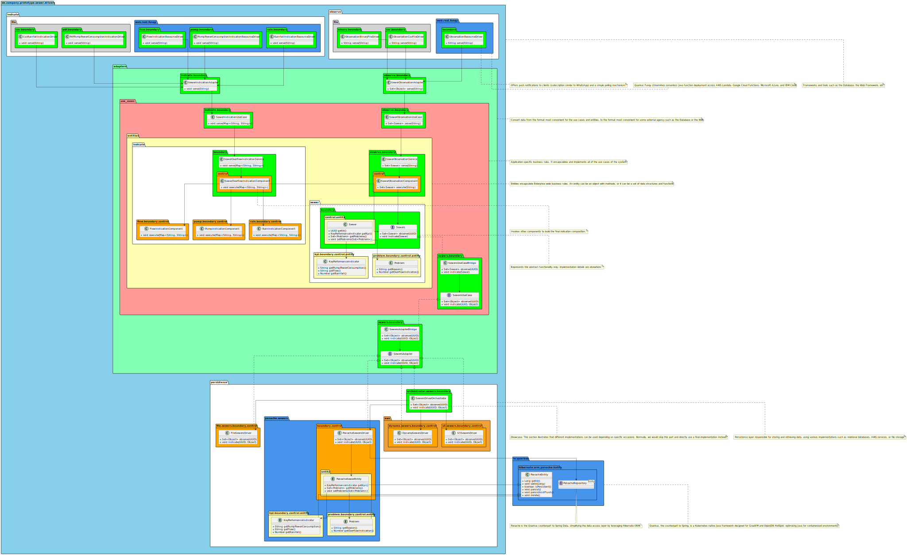

# Product Backlog

## User stories

| ID | User Story                                                                                                                                                                                                                                                     |
|----|----------------------------------------------------------------------------------------------------------------------------------------------------------------------------------------------------------------------------------------------------------------|
| 1  | As an operator, I want to have an indication of which sewers are likely to overflow in case of heavy rain. I want to have information on the location of the sewers and the possible cause of the problem, so that I can send a technician to check the sewer. |
| 2  | As an operator, I want to calculate which sewers are likely to overflow before the event happens.                                                                                                                                                              |
| 3  | As the CEO of my company, I want the application running in the cloud to lower my total cost of ownership. All data transfers must be secure.                                                                                                                  |
| 4  | As an operator, I want to visualize three different KPIs in one diagram (x-axis time, y-axis KPI) so that I can identify trends for KPIs.                                                                                                                      |

## Tasks

| ID | Task                                                                                                                                                                                                                                                                                                                                          |
|----|-----------------------------------------------------------------------------------------------------------------------------------------------------------------------------------------------------------------------------------------------------------------------------------------------------------------------------------------------|
| 1  | The team architect is unfortunately ill, and the product owner has asked you to create a high-level architecture to realize user stories 1-4. The other day he wanted you to sketch your proposal on the whiteboard to discuss with him how the requirements might be realized.                                                               |
| 2  | Before the refinement meeting, you have been asked to refine user story 2 by so-called developer tasks. In our project, a developer task can be completed within 8-16 hours including the necessary activities to ensure the required quality. Please refine user story 2.                                                                    |
| 3  | Your chief security officer asked you about the progress of user story 3 and what it would mean to transmit and store data with a public cloud provider. In particular, Amazon Web Services is her favorite. Since she does not have the relevant information about the security of a cloud provider you start to explain her the principles. |
| 4  | Due to the high-pressure of the project, it is required to make use of 3rd party components for user story 4. The visualization is considered as one of the topics that has high complexity. Therefore, you volunteer to identify one visualization framework and describe why it is useful for the given application.                        |

## Solutions

| ID | Solution                                                                                                                                                                                                                                                                                                                                                                                                                                                                                                                                                                                                  |
|----|-----------------------------------------------------------------------------------------------------------------------------------------------------------------------------------------------------------------------------------------------------------------------------------------------------------------------------------------------------------------------------------------------------------------------------------------------------------------------------------------------------------------------------------------------------------------------------------------------------------|
| 1  |                                                                                                                                                                                                                                                                                                                                                                                                                                                                                                                                                                    |
| 2  | Developer Tasks:   - Get overflow-forecast via REST-API   - Add new value to the chart visualization framework [Chart.js Multi-Axis Example](https://www.chartjs.org/docs/latest/samples/line/multi-axis.html)   - Add ac-test rest-assured   - Add e2e-test for UI                                                                                                                                                                                                                                                                                                                           |
| 3  | [What is Amazon Cognito?](https://docs.aws.amazon.com/de_de/cognito/latest/developerguide/what-is-amazon-cognito.html) (provides HTTPS out of the box)   To enhance security, it's recommended not to process raw data directly. Instead, consider manual encryption using techniques like hashing or salting. [encryption-hashing-salting](https://www.thesslstore.com/blog/difference-encryption-hashing-salting/)                                                                                                                                                                                   |
| 4  | Visualization Framework: [Chart.js](https://www.chartjs.org/) (best practice)   **Why Chart.js is Useful for the given task**   - **Ease of Use:** Simple API for quick implementation.   - **Wide Range of Chart Types:** Supports complex, multi-axis visualizations.   - **Customization:** Highly customizable to meet specific needs.   - **Performance:** Efficient handling of large data sets with smooth rendering.   - **Community Support:** Extensive resources and regular updates.   - **Personal Experience:** Proven reliability and effectiveness in past projects. |

## Refinement (user story 2)

### Developer Tasks

| ID | Task Description                                                                                                                                   |
|----|----------------------------------------------------------------------------------------------------------------------------------------------------|
| 1  | Get overflow-forecast via REST-API                                                                                                                 |
| 2  | Add new value to the chart visualization framework [Chart.js Multi-Axis Example](https://www.chartjs.org/docs/latest/samples/line/multi-axis.html) | |
| 3  | Add ac-test rest-assured                                                                                                                           |
| 3a | test indication                                                                                                                                    |
| 3b | test observation                                                                                                                                   |
| 3c | test polling                                                                                                                                       |
| 4  | Add e2e-test for UI                                                                                                                                |
| 4a | test observation                                                                                                                                   |
| 4b | test polling                                                                                                                                       |